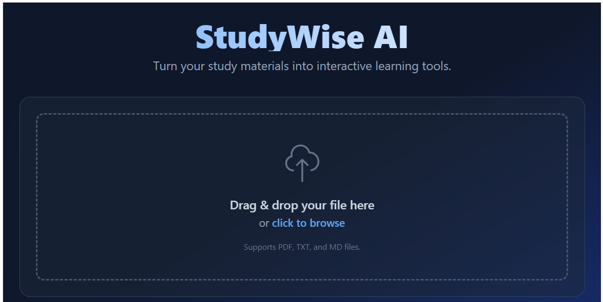
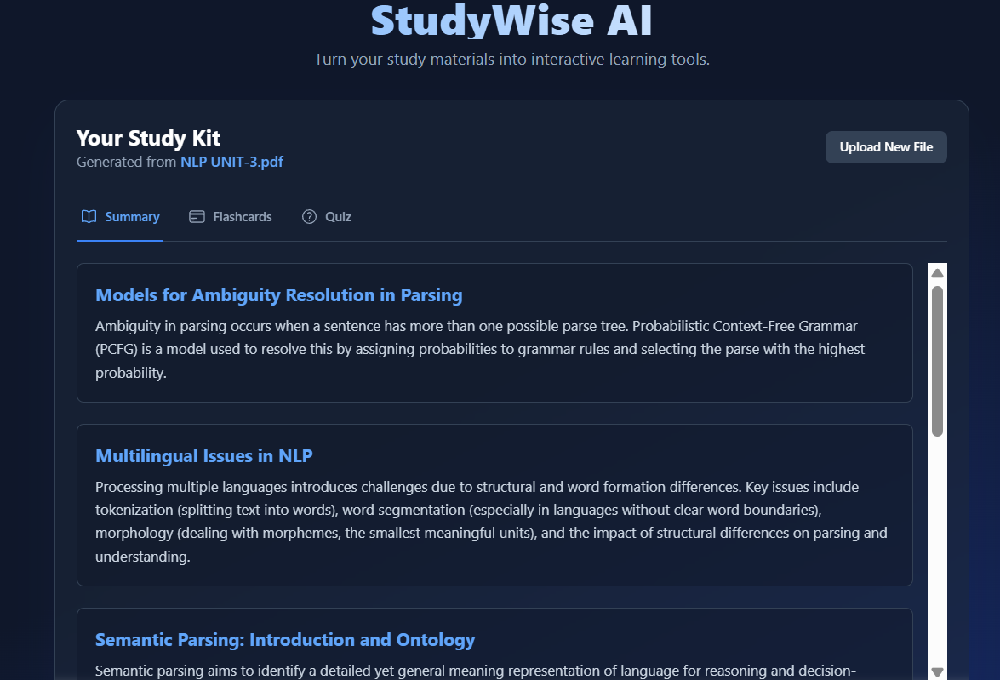
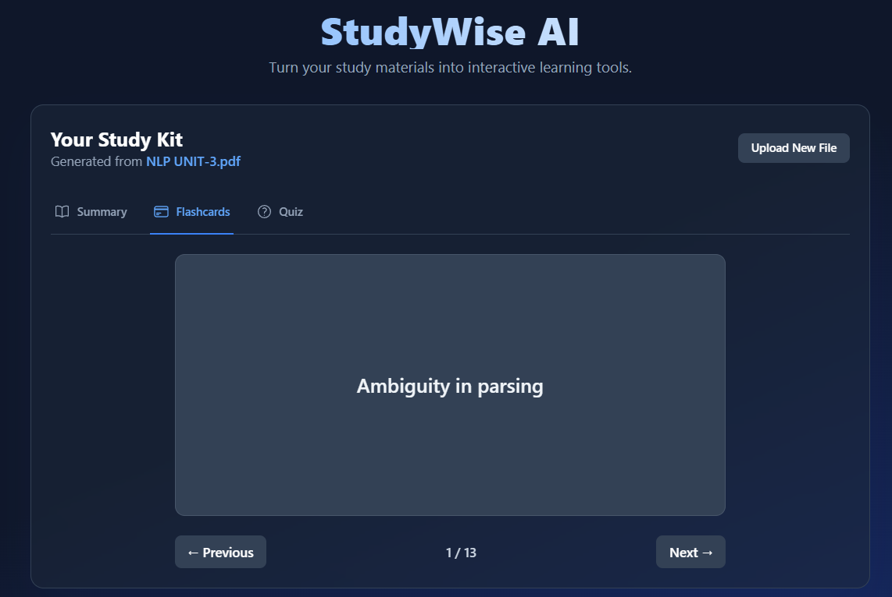
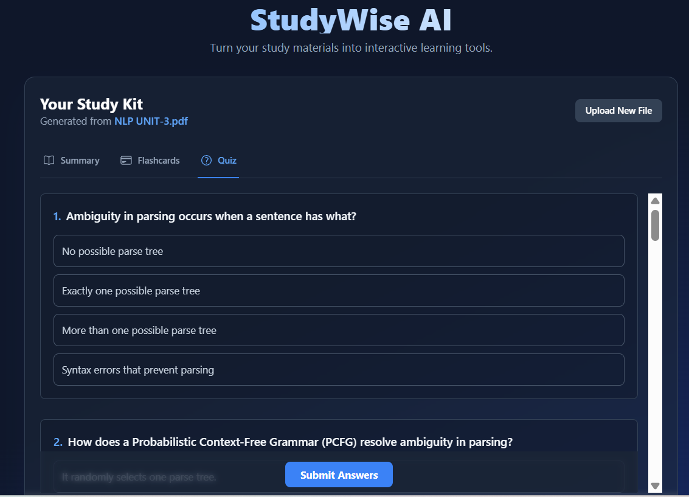

# AI Study Buddy - Smart Learning Platform

## Project Preview

### Homepage

### Summary Generation

### Flashcards

### Quiz Interface

---

## Overview

AI Study Buddy is an AI-powered smart learning platform designed to enhance personalized learning experiences for students. The platform transforms study materials into interactive learning tools such as summaries, flashcards, and quizzes using AI-driven concepts.

The project focuses on improving student engagement, intelligent educational assistance, and interactive learning support through modern frontend architecture and AI-assisted workflows.

---

## Features

- AI-assisted study support
- Automatic summary generation
- Smart flashcard creation
- Interactive quiz modules
- Personalized learning experience
- User-friendly interface
- File upload support for study materials

---

## Technologies Used

- TypeScript
- React
- HTML
- CSS
- AI-assisted application architecture
- Component-based frontend development

---

## Project Structure

- Reusable UI components
- Service-based architecture
- Utility modules
- Interactive learning workflows
- Modular frontend structure

---

## Applications

- Smart education systems
- Personalized learning platforms
- AI-assisted academic support
- Interactive digital learning ecosystems

---

## Future Improvements

- NLP-based doubt solving
- AI chatbot integration
- Adaptive learning systems
- Real-time student performance analytics
- Advanced recommendation systems

---

## Developer

Harshitha Algubelli  
B.Tech – Computer Science (AI & ML)
